# Dependencies

Central dependency map for this repo. When any component changes, including deletion, check this file to know what else needs updating. It complements the distributed `depends_on`/`depended_by` fields carried in individual component files.

Why this exists: distributed dependency metadata disappears the moment a file is deleted. This central map survives deletions and captures relationships that span the whole system, not just the file being edited.

---

## Folder-level dependencies

When something changes in a folder, these files need checking.

| Folder | Files to update | Notes |
|--------|----------------|-------|
| `Work/example-project/` | .claude/rules/atlas-production-standards.md, .claude/rules/atlas-production-examples.md, CLAUDE.md (current focus table), AGENTS.md (current focus table) | Stand-in software project mapped to the fabricated Atlas platform. The production rules quote code patterns from this project directly, so a structural change here can make a rule example stale |
| `Learning/deep-dives/` | README.md (system map count), CLAUDE.md (deep-dive skill entry) | Holds one fabricated example deep-dive doc. New deep dives increment the README system map count |
| `memory/` | .claude/rules/memory-provenance.md, CLAUDE.md | Provenance-tagged memory folder with four types: user, feedback, project, reference. The memory-provenance rule governs how entries are tagged and how conflicting entries get weighted |
| `.agents/skills/` | .claude/skills/first-principles/SKILL.md, .claude/skills/objective-review/SKILL.md, .claude/skills/socratic-questioning/SKILL.md, CLAUDE.md, AGENTS.md, .claude/README.md | Portable, tool-agnostic copies of 3 skills. Content must mirror the .claude/skills/ versions exactly. The .claude/ copy points back with a canonical_copy field in frontmatter |
| `.claude/agents/` | CLAUDE.md, AGENTS.md, .claude/README.md, README.md | All 8 agents are listed in every index file. README.md carries the system map agent count |
| `.claude/skills/` | CLAUDE.md, AGENTS.md, .claude/README.md, README.md | All 26 skills are listed in every index file. README.md carries the system map skill count |
| `.claude/rules/` | CLAUDE.md, .claude/README.md, README.md | AGENTS.md does not list individual rules. atlas-production-standards.md and atlas-production-examples.md also depend on Work/example-project/; memory-provenance.md also depends on memory/; book-inventory-check.md also depends on Learning/deep-dives/ |
| `DEPENDENCIES.md` | (self, update when system structure changes) | This file must be updated whenever a new folder, component, or relationship is added to the repo |

---

## Bidirectional syncs

These pairs must always match. When one changes, copy the change to the other.

| File A | File B | What must match |
|--------|--------|-----------------|
| CLAUDE.md | AGENTS.md | Current focus table |
| CLAUDE.md | AGENTS.md | Sub-agents table |
| CLAUDE.md | AGENTS.md | Skills table |
| CLAUDE.md | README.md | Rules table (both list all 36 rules) |
| CLAUDE.md | README.md | Skills table (both list all 26 skills with counts) |
| README.md system map | actual folder structure | Hardcoded counts (agents, skills, rules) must match reality |
| .agents/skills/first-principles/SKILL.md | .claude/skills/first-principles/SKILL.md | Portable skill content must match |
| .agents/skills/objective-review/SKILL.md | .claude/skills/objective-review/SKILL.md | Portable skill content must match |
| .agents/skills/socratic-questioning/SKILL.md | .claude/skills/socratic-questioning/SKILL.md | Portable skill content must match |

---

## Component-to-component dependencies

Skills, agents, and rules that depend on each other.

### Skills that invoke other skills

| Skill | Invokes |
|-------|---------|
| forge | socratic-questioning, objective-review, first-principles |
| board | socratic-questioning, objective-review, first-principles |
| ship | docs-sync agent, git-sync agent |
| deep-dive | web-research (topic-mode engine); dispatches a fresh-context grader agent |
| system-retro | objective-review |
| checkin-notes | meeting-notes agent, action-planner agent, ship skill |
| ingest-workflows | ship |
| bossman-mode | dispatches fresh-context subagents per phase; no fixed skill invocation, chosen at runtime |

### Skills that read memory/

| Skill | Reads |
|-------|-------|
| forge | memory/ (project and feedback entries, to calibrate exercise difficulty) |
| board | memory/ (user and project entries, for board session context) |
| checkin-notes | memory/ (project entries, for prior action item context) |
| handoff | memory/ (all four types, to compact session state) |

### Skills that write to folders

| Skill | Writes to |
|-------|-----------|
| deep-dive | Learning/deep-dives/ (default save location; user can choose another path at save time) |
| repo-dive | Work/example-project/ or a sibling clone target, illustrative in this demo repo |
| handoff | session scratchpad by default; a repo-root HANDOFF.md only if explicitly asked |
| os-maintain | .claude/agents/, .claude/skills/, .claude/rules/ (scaffolds new components); can scaffold a new project repo outside this one |

### Agents that follow rules

| Agent | Uses rules |
|-------|-----------|
| meeting-notes | meeting-notes-format, file-naming |
| git-sync | git-workflow, sandbox-diagnosis |
| code-reviewer | atlas-production-standards, atlas-production-examples |
| docs-sync | (reads a routing table internally, not a single named rule) |

### Agents that use skills

| Agent | Uses skills |
|-------|------------|
| first-principles | first-principles skill |
| socratic | socratic-questioning skill |
| objective-review | objective-review skill |

### Skills that use rules

| Skill | Uses rules |
|-------|-----------|
| bossman-mode | bossman-mode rule (behavioral overrides), parallel-first, boil-the-lake, goal-contracts, anti-rationalization |
| checkin-notes | meeting-notes agent, action-planner agent, ship skill, meeting-notes-format rule, file-naming rule |
| handoff | writing-style rule, file-protection rule |
| deep-dive | doc-construction, writing-style, self-eval-loop, pdf-docx-conversion |

### Rules that reference folders

| Rule | References |
|------|-----------|
| book-inventory-check | Learning/deep-dives/ (only subfolder that exists in this repo) |
| atlas-production-standards | Work/example-project/ (source of the code patterns the rule enforces) |
| atlas-production-examples | Work/example-project/ (before/after pairs drawn from this project) |
| memory-provenance | memory/ (all four types: user, feedback, project, reference) |
| anti-rationalization | .claude/skills/ (applies to every multi-step skill in that folder) |
| dependency-tracking | .claude/agents/, .claude/skills/, .claude/rules/ (every component in these three folders needs depends_on/depended_by) |

---

## Index file fan-in

Files that are referenced by the most components. When these break, everything breaks.

| File | Referenced by | Count |
|------|--------------|-------|
| CLAUDE.md | All 26 skills, all 8 agents, all 36 rules, session-greeting, docs-sync | 40+ |
| AGENTS.md | All 26 skills, all 8 agents, docs-sync | 30+ |
| .claude/README.md | All 26 skills, all 8 agents, all 36 rules | 30+ |
| README.md | docs-sync, ingest-workflows, multiple skills, system map counts | 10+ |
| GROWTH_SYSTEM.md | forge, board, system-retro, book-builder skills | 6+ |
| CHANGELOG.md | docs-sync, ship, ingest-workflows | 5+ |
| EXTENSIONS.md | CLAUDE.md, AGENTS.md, README.md, .claude/README.md | 4+ (source of truth for any external tool references) |
| SYSTEM_OVERVIEW.md | All system component folders feed into it; CLAUDE.md, AGENTS.md, .claude/README.md, README.md reference it | 10+ (comprehensive reference, updated when components change) |

---

## Deletion checklist

When deleting a component, check these specific files.

| Deleting a... | Check these files |
|---------------|-------------------|
| Skill | CLAUDE.md skills table, AGENTS.md skills table, .claude/README.md skills list, README.md skills table + system map count, CHANGELOG.md, DEPENDENCIES.md (component tables) |
| Agent | CLAUDE.md sub-agents table, AGENTS.md sub-agents table, .claude/README.md agents list, README.md agents table + system map count, CHANGELOG.md, DEPENDENCIES.md (component tables) |
| Rule | CLAUDE.md rules table, .claude/README.md rules table, README.md rules table + system map count, CHANGELOG.md, DEPENDENCIES.md (if the rule referenced a folder) |
| Portable skill (.agents/skills/) | The matching .claude/skills/ copy (remove canonical_copy pointer or delete both), CLAUDE.md, AGENTS.md, .claude/README.md |
| Deep-dive doc | Learning/deep-dives/, README.md (system map count), CHANGELOG.md |
| Memory entry | memory/ index (if one exists), any rule or skill that cited it by name |
| Work/example-project/ content | atlas-production-standards.md, atlas-production-examples.md (check for stale code quotes), CLAUDE.md and AGENTS.md current focus tables |

### Moving files between folders

Moving is a deletion from the source plus a creation at the destination. Check both sides.

| Moving a... | Source checks | Destination checks |
|-------------|--------------|-------------------|
| Deep-dive doc to a new subfolder | README.md (if the old path was listed) | README.md (new path), CHANGELOG.md |
| A skill between .claude/skills/ and .agents/skills/ | The losing folder's README references | The gaining folder's README references, plus the canonical_copy pointer |
| A file from repo root into a subfolder | README.md (if listed), CHANGELOG.md | Destination folder's own index, if it has one |

### Renaming components

Renaming is a deletion plus a creation. Apply the deletion checklist for the old name, then the creation updates for the new name. Additionally check:
- Every file that invokes the component by name (see the "Skills that invoke other skills" and "Agents that use skills" tables above)
- README.md system map, if a folder rename changes a path
- Magic words or trigger phrases listed in CLAUDE.md and AGENTS.md, if a skill or agent's invocation name changed

---

## Dependency chains (multi-hop)

Chains where a change cascades through two or more components.

| Trigger | Hop 1 | Hop 2 | Hop 3 |
|---------|-------|-------|-------|
| New skill created | .claude/README.md, CLAUDE.md, AGENTS.md | README.md (skill count in system map) | GROWTH_SYSTEM.md (only if the skill is growth-related) |
| Portable skill updated (e.g. socratic-questioning) | .agents/skills/socratic-questioning/SKILL.md | .claude/skills/socratic-questioning/SKILL.md (must match) | CLAUDE.md and AGENTS.md skills table (if the description changed) |
| Work/example-project/ code pattern changes | atlas-production-standards.md, atlas-production-examples.md | code-reviewer agent output changes to match | CLAUDE.md current focus table, if the project's status changed too |

---

## Visual dependency graph

```mermaid
graph TD
    subgraph index["Index files"]
        RM["README.md"]
        CM["CLAUDE.md"]
        AM["AGENTS.md"]
        CR[".claude/README.md"]
        CL["CHANGELOG.md"]
        GS["GROWTH_SYSTEM.md"]
        GL["GOALS.md"]
        SO["SYSTEM_OVERVIEW.md"]
        EX["EXTENSIONS.md"]
        DP["DEPENDENCIES.md"]
    end

    subgraph components["Components"]
        SK["Skills"]
        AG["Agents"]
        RU["Rules"]
    end

    subgraph portable["Portable layer"]
        PS[".agents/skills/"]
    end

    subgraph content["Content folders"]
        WP["Work/example-project/"]
        LD["Learning/deep-dives/"]
        ME["memory/"]
    end

    subgraph meta["Meta layer"]
        DS["docs-sync agent"]
        DT["dependency-tracking rule"]
    end

    SK -->|listed in| CM
    SK -->|listed in| AM
    SK -->|listed in| CR
    SK -->|listed in| RM
    AG -->|listed in| CM
    AG -->|listed in| AM
    AG -->|listed in| CR
    AG -->|listed in| RM
    RU -->|listed in| CM
    RU -->|listed in| CR
    RU -->|listed in| RM

    PS <-->|3 skills mirror| SK

    CM <-->|3 tables sync| AM
    CM <-->|2 tables sync| RM

    WP -->|feeds rule examples| RU
    LD -->|system map count| RM
    ME -->|governs tagging| RU

    DS -->|updates| RM
    DS -->|updates| CM
    DS -->|updates| AM
    DS -->|updates| CL
    DS -->|updates| CR
    DS -->|reads| DP
    DT -->|enforces| SK
    DT -->|enforces| AG
    DT -->|enforces| RU

    GL -->|informs| GS
    SO -.->|summarizes| components
```

### How to read this graph

Solid arrows show direct dependencies: when the source changes, the target needs checking. Double arrows show bidirectional syncs, where both sides must always match. Index files at the top are the most referenced files in the repo, so they break first when a component below them changes. Components (skills, agents, rules) all flow upward into the index files. The portable layer mirrors 3 skills into a tool-agnostic copy, so a change there has to land in two places, not one. Content folders connect to the specific rules and index files that quote or count them. The meta layer at the bottom monitors and maintains everything above it: docs-sync updates the index files, dependency-tracking enforces the depends_on/depended_by metadata on every component. DEPENDENCIES.md itself is read by docs-sync to catch cascading updates, especially deletions.

---

*Last updated: example date, replace with your own*
