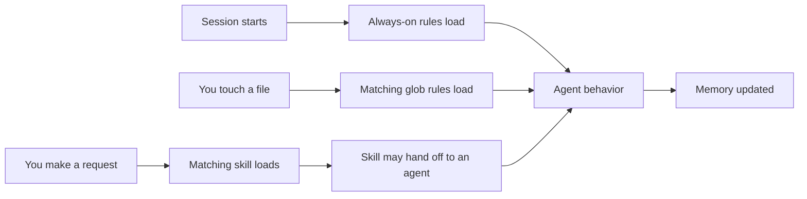

# Getting started

A walkthrough for someone who just forked or cloned this repo and wants a working system, not just a folder of markdown to read.

## Contents

- [What problem this solves](#what-problem-this-solves)
- [Prerequisites](#prerequisites)
- [Fork or clone the repo](#fork-or-clone-the-repo)
- [One-time setup: make it yours](#one-time-setup-make-it-yours)
- [How the loading model works](#how-the-loading-model-works)
- [Your first 15 minutes](#your-first-15-minutes)
- [What to do next](#what-to-do-next)

## What problem this solves

An AI coding agent with no configuration is a blank slate every session. It has no fixed opinion on how you want code written, no memory of what you told it last week, and no sense of which decisions are yours to make versus which it can safely make for you.

This repo is a working example of closing that gap with three kinds of files, all plain markdown, all readable and editable by hand:

- Rules that the agent applies automatically, either every session or when you touch a matching file
- Skills the agent loads only when your request matches what the skill does
- A memory folder the agent reads from and writes to, so facts and feedback persist across sessions instead of resetting each time

Fork this repo, replace the fabricated example content with your own, and you have a running version of the same system, not a description of one.

## Prerequisites

You need an AI coding agent that reads a root-level context file (`CLAUDE.md`, `AGENTS.md`, or similar) at session start and supports project-scoped custom rules, skills, or agents defined as markdown with YAML frontmatter. Claude Code is what this repo was built against. Other agents that support an equivalent extension model (custom instructions, project rules, custom commands) can use the same files with minor adaptation, most likely to the frontmatter format each tool expects.

You do not need any build tooling, package manager, or runtime to use the framework itself. The one exception is `Work/example-project/`, a stand-in for a real software project, which would carry its own language-specific setup once you replace it with actual code.

## Fork or clone the repo

```bash
git clone https://github.com/<your-fork>/ai-chief-of-staff.git
cd ai-chief-of-staff
```

If you plan to keep contributing back or tracking upstream changes, fork on GitHub first, then clone your fork. If you just want a personal starting point, cloning directly and starting a fresh history works too:

```bash
rm -rf .git
git init
git add .
git commit -m "Start from ai-chief-of-staff template"
```

## One-time setup: make it yours

Every fabricated name in this repo is a placeholder, not a real project. Before you rely on the system day to day, do one pass of search and replace:

| Placeholder | Replace with | Where it shows up |
|-------------|--------------|---------------------|
| Atlas | Your actual primary project name | `CLAUDE.md`, `AGENTS.md`, `Work/example-project/`, rules scoped to that folder |
| Meridian | Your actual org or company name | Security examples in `.claude/rules/atlas-production-examples.md` |
| example.org | Your actual domain | URL validation examples in the same rules |
| Knowledge graph (KG), AI cohort, Search | Your actual secondary projects, or delete the rows | Current focus tables in `CLAUDE.md` and `AGENTS.md` |

After the substitution pass, delete or rename `Work/example-project/` and put your real project there, or point the `atlas-production-standards` and `atlas-production-examples` rule globs at wherever your real code lives.

Nothing else needs a mechanical find-and-replace. The rules, skills, and agents that are not project-specific (file protection, writing style, dependency tracking, and the rest) already describe the mechanism, not any specific content, and work unchanged.

## How the loading model works

Not every file loads the same way, and knowing which is which changes how you write new ones.

Always-on rules load at the start of every session, regardless of what you are doing. Use these sparingly, for behavior that should never lapse: don't delete without asking, use plain language, ask one question at a time.

Glob-scoped rules load only when you touch a file matching a path pattern. A rule scoped to `Work/example-project/**` stays silent everywhere else and activates the moment you open a file in that folder. This is how project-specific standards (security patterns, a particular framework's conventions) stay out of your way in unrelated work.

Skills load on a match between your request and the skill's one-line description. The agent sees every skill's description up front, cheaply, and only pulls in the full instructions for the one that matches. A well-written description is the single highest-leverage sentence in a skill file: get it wrong and the skill either never fires or fires on the wrong request.

Agents are a step further: a full persona with its own system prompt and, optionally, a restricted set of tools. An agent that only ever reads and writes meeting notes has no business holding a Bash tool, so it does not get one. The restriction lives in what the agent can call, not in an instruction asking it to behave.

Memory is the only layer that changes on its own, driven by what happens in a session rather than by what file you opened. See `memory/` for the four types (user, feedback, project, reference) and how each is tagged for source quality.



## Your first 15 minutes

Three concrete things to try, in order, before you customize anything.

1. Read one rule. Open [.claude/rules/file-protection.md](.claude/rules/file-protection.md). It is short, always-on, and shows the three-state permission pattern (allow, ask, deny) that most rules in this repo follow.
2. Invoke a skill. Ask your agent to explain a concept, "what is a provenance-tagged memory system", for example, and watch the `first-principles` skill activate. Compare the answer's structure (definition, why it exists, how it works, what it means for you) against [.claude/skills/first-principles/SKILL.md](.claude/skills/first-principles/SKILL.md).
3. Check the memory folder. Look in `memory/` at the fabricated example entries. Notice the frontmatter on each: a `type` field and, on feedback and project entries, a source-quality tag. That tagging is what lets a future session weigh a documented decision more heavily than an offhand guess.

## What to do next

Read [README.md](README.md) for the full system map and the diagram of how rules, skills, agents, and memory connect. Read [SYSTEM_OVERVIEW.md](SYSTEM_OVERVIEW.md) when you are ready for the complete granular reference, every component, every loading rule, the full session lifecycle. Read [DEPENDENCIES.md](DEPENDENCIES.md) before you delete or rename anything, so you know what else needs to change.

Then start writing your own rules and skills the same way the examples here are written: short, specific, and scoped to exactly the behavior you want, no more.

---

*Last updated: example date, replace with your own*
