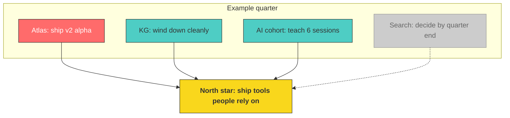

# Goals

Quarterly SMART goals with tiered metrics. This file is a fabricated example. Every name, number, and date below is invented for demonstration purposes. Replace it entirely with your own goals before using this framework for real.

Quarter: Example quarter, replace with your own dates.

## Contents

- [Current focus](#current-focus)
- [Metrics framework](#metrics-framework)
- [Goal 1: Atlas, ship the next milestone](#goal-1-atlas-ship-the-next-milestone)
- [Goal 2: Knowledge graph, wind down cleanly](#goal-2-knowledge-graph-wind-down-cleanly)
- [Goal 3: AI cohort, deliver the teaching commitment](#goal-3-ai-cohort-deliver-the-teaching-commitment)
- [Goal 4: Search, force a decision](#goal-4-search-force-a-decision)
- [Cross-cutting guardrails](#cross-cutting-guardrails)
- [North star, 12 month direction](#north-star-12-month-direction)
- [Closing note](#closing-note)

## Current focus

Four fabricated projects carry this quarter, matched to the status table in CLAUDE.md and AGENTS.md.

| Project | Status | Goal below |
|---------|--------|-------------|
| Atlas | Active, the priority going forward | Goal 1 |
| Knowledge graph (KG) | Winding down | Goal 2 |
| AI cohort | Active, part time teaching commitment | Goal 3 |
| Search | Paused, pending a resourcing decision | Goal 4 |

## Metrics framework

Three tiers per goal, borrowed from the personal-os-work template this repo demonstrates.

| Tier | Purpose | Check frequency |
|------|---------|----------------|
| North star | Directly measures the goal | Weekly |
| Support | Enables the goal, if these move the north star follows | Weekly |
| Do not harm | Guardrails, these must not regress while chasing the goal | Bi-weekly |

## Goal 1: Atlas, ship the next milestone

Goal: ship Atlas v2 alpha as a public, open source release with three working modules. Atlas is the active priority this quarter and every other goal below is scoped so it does not crowd out this one.

| Tier | Metric | Target | How to measure |
|------|--------|--------|----------------|
| North star | v2 alpha shipped | Public repo live at github.example.org/atlas with 3 modules (ingest, search, review) by quarter end | Public repo, tagged release |
| Support | Module 1 (ingest) complete | End to end pipeline processing a 10,000 record sample set with under 2 percent error rate | Pipeline run log |
| Support | Design partner feedback | 3 outside reviewers try the alpha and leave written feedback | Feedback notes filed in the repo |
| Support | Weekly build cadence | At least 4 commits per week, every week of the quarter | Commit log |
| Do not harm | Scope discipline | No module added beyond the 3 agreed at quarter start without a logged decision | Decisions log entry required for any scope change |
| Do not harm | Documentation parity | README and architecture doc updated within 48 hours of any structural change | Commit timestamps vs doc timestamps |

## Goal 2: Knowledge graph, wind down cleanly

Goal: close out the KG project without leaving orphaned services, undocumented data, or confused stakeholders behind. Winding down is itself a deliverable, not a default to neglect.

| Tier | Metric | Target | How to measure |
|------|--------|--------|----------------|
| North star | Clean handoff or archive | KG service either transferred to a named owner or formally archived by quarter end | Handoff doc or archive note, one or the other, not both left undecided |
| Support | Remaining consumers migrated | All 4 known downstream consumers moved off the live KG endpoint | Migration checklist, 4 of 4 checked |
| Support | Documentation snapshot | Final architecture and data dictionary doc written before archive | Doc exists in the repo |
| Do not harm | No silent data loss | Export and back up the underlying dataset before any service shutdown | Backup file exists and is verified readable |
| Do not harm | Stakeholder notice | Every known consumer notified in writing at least 2 weeks before cutover | Notice log with dates |

## Goal 3: AI cohort, deliver the teaching commitment

Goal: deliver the part time teaching commitment at a consistent quality bar without it expanding to consume Atlas time.

| Tier | Metric | Target | How to measure |
|------|--------|--------|----------------|
| North star | Sessions delivered | 6 sessions delivered on schedule across the quarter | Session log |
| Support | Session rating | Average learner rating of 4 out of 5 or higher | Post session survey |
| Support | Prep reuse | At least half of session material reused or adapted from a prior session, not built from scratch each time | Material log |
| Do not harm | Time cap | No more than 4 hours per week spent on cohort prep and delivery combined | Weekly time log |
| Do not harm | Atlas protection | Cohort prep never displaces a scheduled Atlas build block | Weekly calendar review |

## Goal 4: Search, force a decision

Goal: Search stays paused pending a resourcing decision. The goal this quarter is not to build, it is to force an explicit decision by a named date so the project cannot drift back to life without a choice being made.

| Tier | Metric | Target | How to measure |
|------|--------|--------|----------------|
| North star | Decision made, not feature shipped | A written decision, resume with named resourcing or archive, by quarter end | One entry in the decisions log |
| Support | Options brief | A one page brief comparing resume versus archive, with cost and owner for each, ready 2 weeks before the decision date | Brief exists in the repo |
| Do not harm | No silent restart | Zero commits to the Search codebase before the decision is logged, except the options brief itself | Commit log shows no code commits pre-decision |

## Cross-cutting guardrails

Constraints that apply across all four goals, checked regardless of which goal is getting the most attention this week.

| Guardrail | What to watch | Signal it is regressing |
|-----------|---------------|--------------------------|
| Search silent restart | Any code commit to the paused Search project before a decision is logged | A commit appears in the Search codebase with no matching decisions log entry |
| Cohort crowding out Atlas | Teaching prep time versus Atlas build time | Cohort prep exceeds the 4 hour weekly cap two weeks running |
| KG orphaning | Consumers or data left undocumented at wind down | Any consumer migration checklist item left unchecked past its target date |
| Scope creep on Atlas | Modules or features added without a logged decision | A module ships that was not on the original 3 module list |
| Decision hygiene | Whether goal changes get written down | A goal target changes mid quarter with no corresponding decisions log entry |

## North star, 12 month direction

Not SMART, just direction. Revisit quarterly. This section is fabricated example content, replace with your own long range direction.

- Ship tools people actually adopt, not just tools that get demoed once
- Keep one flagship build (Atlas, in this example) moving every single quarter
- Wind down projects on purpose, on a schedule, instead of letting them fade unmanaged
- Treat paused work as a decision waiting to happen, not a default state

## Closing note

Everything in this file, the project names, the numbers, the dates, and the decisions, is fabricated for demonstration. If you fork this repo, delete this file's content and write your own quarterly goals, your own metrics, and your own guardrails. The value here is the shape of the document, not the specific targets.

*Last updated: example date, replace with your own*
