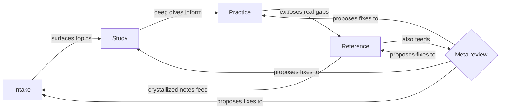

# Growth system

How the four growth pillars work together, and which parts of this pattern are actually built in this repo versus left for you to build.

## Contents

- [What is the growth system?](#what-is-the-growth-system)
- [Why it exists](#why-it-exists)
- [The four pillars](#the-four-pillars)
- [How they connect](#how-they-connect)
- [The one demonstrated pillar: Study](#the-one-demonstrated-pillar-study)
- [Meta-layer: the system reviews itself](#meta-layer-the-system-reviews-itself)
- [What this means for you](#what-this-means-for-you)

## What is the growth system?

A growth system is a loop, not a folder. Four stages feed each other: you take in new information, you study the parts worth going deep on, you practice applying what you studied, and you crystallize what you learned into something reusable. Then the loop starts again.

This repo shows the shape of that loop. Only one stage, Study, is actually built here, using `Learning/deep-dives/`. The other three are described as patterns you build yourself, in your own fork, shaped to your own field and habits.

## Why it exists

Without a growth loop, an AI agent only ever helps you finish today's task. Nothing you learn along the way gets captured, and nothing you capture gets practiced. The growth system exists to close that gap: every pillar hands something concrete to the next one, so learning compounds across sessions instead of evaporating at the end of each one.

## The four pillars

| Pillar | Folder in this repo | Purpose | Pattern to build in your own fork |
|--------|---------------------|---------|-------------------------------------|
| Intake | Not built here | Stay current on your field | An inbox pipeline that pulls in newsletters, papers, or feeds, scores them against topics you care about, and turns the noise into a short daily or weekly briefing |
| Study | `Learning/deep-dives/` | Build deep knowledge on a topic | Already demonstrated here. See below |
| Practice | Not built here | Apply what you learned | A daily or weekly exercise loop, small and repeatable, that forces you to use a concept instead of just reading about it |
| Reference | Not built here | Turn practice into reusable thinking | A place to write short, first-principles notes once you have solved a problem, so the next time it comes up you read your own prior thinking instead of starting from zero |

## How they connect

Reading the loop: intake surfaces a topic worth attention. Study goes deep on that topic. Practice forces you to apply what study produced, which is where real gaps show up. Reference turns a solved gap into a short, reusable note, and that note either feeds back into intake as a refined interest or straight into the meta-review step, which looks at the whole loop and proposes fixes to any of the four pillars.

## The one demonstrated pillar: Study

`Learning/deep-dives/` is the only pillar folder that actually exists in this repo. It holds first-principles deep dives, each one a document, a URL, or a bare topic worked through in a fixed nine-move shape: define it, collapse it to its structure, map it honestly, diagram it, work an example, apply skepticism, and state what it means for you.

The `deep-dive` skill (`.claude/skills/deep-dive/`) produces these. A dive can run source-only, reasoning strictly from a supplied document or URL, or with `--research` to pull in outside material. Either way the output lands in `Learning/deep-dives/<topic>/` by default, and it asks before saving anywhere else.

This is the one concrete example in the whole four-pillar loop. Everything upstream of it (what fed the topic in) and everything downstream of it (how you practice it, how you crystallize it further) is left for you to design, because intake sources, practice habits, and reference formats are personal to whoever forks this repo.

## Meta-layer: the system reviews itself

A growth loop that never checks its own health drifts. The meta-layer is a periodic step that steps back from the four pillars and asks whether the loop itself is still working: are the pillars still connected the way this document describes, are any of them stale, contradictory, or dead weight.

In this repo, that mechanism already exists: the `system-retro` skill (`.claude/skills/system-retro/`). It audits rules, skills, agents, workflows, and documentation for staleness, gaps, and contradictions, then proposes and applies fixes. It is not scoped only to the growth pillars, it audits the whole personal OS, but the growth loop is squarely inside that scope, since `GROWTH_SYSTEM.md` itself is one of the files it depends on and checks.

If you build out Intake, Practice, and Reference in your own fork, point `system-retro` at them too, the same way it already watches Study through this file and `Learning/`.

## What this means for you

Three of the four pillars are deliberately left unbuilt in this example. Intake, Practice, and Reference are named, explained, and given a clear purpose and a clear handoff to the next pillar, but no folder, config, or skill backs them in this repo. Only Study is demonstrated concretely, through `Learning/deep-dives/` and the `deep-dive` skill.

That is a deliberate choice, not an oversight. Intake sources, practice habits, and reference formats are the parts of a growth system that are most personal to whoever is running it. Fork this repo, keep the loop shape and the meta-review habit, and build the other three pillars around your own field, your own schedule, and your own way of writing things down.

*Last updated: example date, replace with your own*
