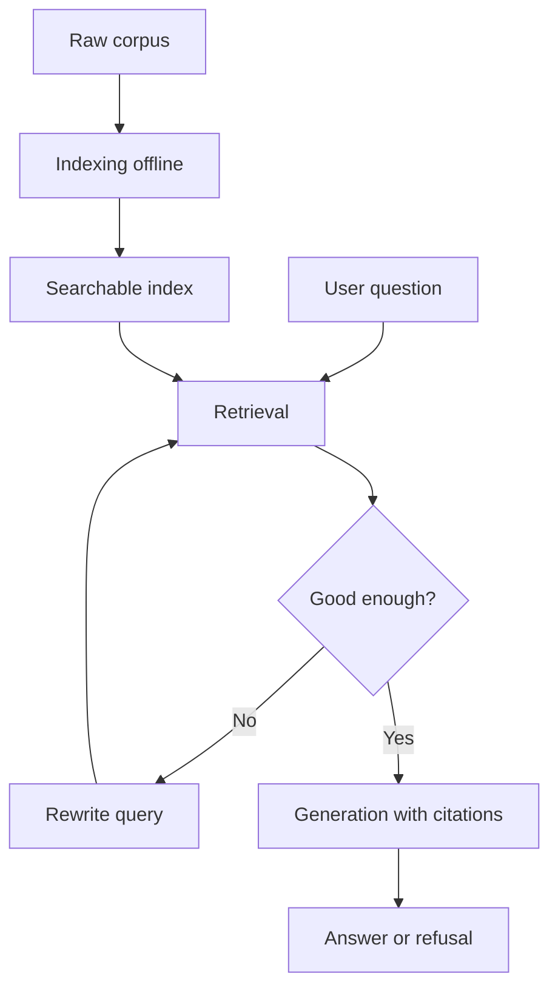

<!-- depends_on: [] -->
<!-- depended_by: [] -->

# Retrieval-augmented generation: a first-principles deep dive

This is a topic-mode dive: no single document or URL was handed in, so the normal shape would gather sources from live web research before writing. This copy is a fabricated demo entry, written to show what the deep-dive skill produces, so no external sources were fetched. The technical claims below are standard, widely documented mechanics of retrieval-augmented generation (RAG), not specifics from any fetched page. Built: example date, replace with your own.

## Contents

- [What is retrieval-augmented generation?](#what-is-retrieval-augmented-generation)
- [The one idea](#the-one-idea)
- [The real structure](#the-real-structure)
- [Mapped honestly](#mapped-honestly)
- [How it fits together](#how-it-fits-together)
- [A worked example](#a-worked-example)
- [Where it is strong, where to be skeptical](#where-it-is-strong-where-to-be-skeptical)
- [What this means for you](#what-this-means-for-you)
- [Sources](#sources)

## What is retrieval-augmented generation?

RAG is a way of getting a language model to answer questions using specific documents you hand it, instead of only what it memorized while training.

Think of a closed-book exam versus an open-book exam. A model answering from memory alone is taking a closed-book exam: whatever it learned during training is all it has, and if it never saw the fact, it will guess, sometimes confidently and wrongly. RAG turns the same exam open-book: right before the model answers, a search step hands it a small stack of relevant pages, and the model is expected to answer from those pages and point at which one it used.

## The one idea

RAG moves factual correctness out of the model's memory and into a search step you can inspect, test, and update on its own.

Everything else about RAG follows from that move. If correctness now depends on search, then the quality of the whole system depends on the quality of that search step, not on how large or well trained the model is. A small model with a good search step beats a huge model with a bad one, on any question the huge model was never trained on. This is also why RAG lets you add new facts (a new document, an updated policy) without retraining anything: you only have to make the new fact findable.

## The real structure

There is a long list of named RAG variants: naive RAG, RAG-fusion, self-RAG, corrective RAG, graph RAG, agentic RAG, hypothetical document embeddings (HyDE), multi-hop RAG, and more. Read as a list, it looks like a dozen different techniques. It collapses to three stages, and every named variant is a change to one of them.

| Stage | What it does | Named variants that change this stage |
|-------|---------------|----------------------------------------|
| Indexing | Turns a corpus into something searchable, done once, offline, before any question arrives | Graph RAG (indexes entities and relationships instead of flat text chunks) |
| Retrieval | Given a question, pulls the smallest set of items that actually contain the answer | Naive RAG (fixed top-k similarity search), RAG-fusion (multiple rewritten queries merged by rank), HyDE (generates a hypothetical answer first, then searches for text similar to that) |
| Generation | Feeds the retrieved items into the model's context alongside the question and asks it to answer, ideally citing which item it used | Self-RAG and corrective RAG (add a grading step that checks whether the retrieved items were actually good enough before generating, and re-retrieves if not) |

Agentic RAG does not add a fourth stage. It wraps a control loop around all three: the model decides for itself when the current retrieval is insufficient, rewrites the question, and retrieves again, possibly several times, before generating. It is a loop over the same three primitives, not a new primitive.

Twelve named techniques, three stages. That is the whole collapse.

Why the collapse matters practically: once you see the three stages, a hard technology decision turns into three separate, smaller decisions instead of one confusing one. You can pick a simple approach for indexing, a more careful approach for retrieval, and a strict citation rule for generation, without those three choices being coupled to a single named "RAG framework" someone is selling.

## Mapped honestly

Solid and well documented: the three-stage split above, the mechanics of vector similarity search (turn text into numeric vectors, find the nearest vectors to the question's vector), and the general principle that ungrounded generation over retrieved text is a known failure mode worth explicitly guarding against.

Thin or not fixed by any single source: there is no single agreed definition of "agentic RAG" across vendors and papers, different write-ups draw the loop boundary in different places. The actual latency and cost tradeoff between graph RAG and flat vector RAG also varies enormously by corpus size and question type, and no fixed benchmark number is safe to quote generically, so none is given here. Where a real number matters, it belongs in a benchmark run against your own corpus, not in this document.

## How it fits together

Read it as a loop with an offline half and an online half. Indexing happens once, ahead of any question, and produces the searchable index. Each question then runs the online loop: retrieval pulls candidates from that index, a check decides whether those candidates are actually good enough to answer from, and if not the query gets rewritten and retrieval runs again. Only once the check passes does generation run, and it should always produce either a cited answer or an explicit refusal, never a guess dressed up as a cited answer.

## A worked example

Atlas, the fabricated web platform this repo tracks as the active priority project, ships a help center. Someone asks it "how do I reset a shared workspace." The reliable pattern: every help page gets indexed once (chunked, turned into vectors, stored). When the question comes in, retrieval pulls the handful of chunks whose vectors are closest to the question's vector. A check step looks at those chunks and asks whether any of them plausibly contain the answer, using a similarity score against a fixed threshold. If yes, generation writes an answer and cites the specific help page it drew from. If none of the retrieved chunks clear the threshold, the honest output is "I could not find this in the help docs," not a fluent guess assembled from unrelated pages.

The specific-case reading: the exact threshold value, the exact number of chunks retrieved, and whether Atlas's help center actually needs query rewriting are all implementation decisions for that one system, not general RAG law. The reliable pattern is the shape: retrieve, check before generating, cite or refuse.

A second pass through the same example shows the rewrite loop: someone asks "why did my workspace disappear," which is really the same reset question phrased as a complaint rather than a how-to. If the first retrieval pulls low-similarity chunks about billing instead of workspace resets, the check step should catch that the top results are weak and trigger a rewrite, for example turning the complaint into "reset shared workspace" before retrieving again. Skipping that check is exactly how a RAG system answers confidently from the wrong document.

## Where it is strong, where to be skeptical

Strong: RAG is dramatically cheaper than retraining a model every time a fact changes. Add or edit a document and it is searchable on the very next question. It also gives you a debuggable failure: when an answer is wrong, you can look at exactly which passages were retrieved and see whether the problem was retrieval (wrong passages) or generation (right passages, wrong reading), instead of guessing at what a closed model "knows." It also composes well with the cite-or-refuse habit: because the answer is built from named passages, refusing when nothing relevant was found is a natural default rather than an awkward extra feature bolted on afterward.

Skeptical: the retrieval step is the actual bottleneck, and it is invisible unless you deliberately measure it. A system can look like it is working in every casual test and still be quietly wrong on the questions that matter, because generation over the wrong passages still produces a fluent, confident answer. That is a new failure mode layered on top of the old one: instead of the model hallucinating from nothing, it now hallucinates from irrelevant context and sounds grounded while doing it. The single most common gap: teams ship a RAG feature without ever building a retrieval eval, a labeled set of questions paired with the passage that should have been retrieved for each, so nobody can tell whether retrieval quality is 95 percent or 60 percent. A demo that looks fine on five hand-picked questions tells you nothing about the other four hundred.

## What this means for you

Two live projects on your board touch this directly. Atlas is the active priority, and Search sits paused pending a resourcing decision, per the current focus table in CLAUDE.md. RAG is exactly the fork that decision sits on, and it resolves in a specific order: the indexing question (flat text chunks or an entity graph) is downstream of what corpus you actually have, not a free technology choice you make first. Knowledge graph (KG) is winding down, which means the entity-graph groundwork that would make graph RAG close to free is deliberately not being maintained. Given that, the honest default for a Search decision made in this window is flat vector RAG, not graph RAG: it is cheaper to stand up and does not require reviving an investment you have already chosen to wind down.

The concrete guardrail, whichever way Search resolves: do not ship anything user-facing before there is a retrieval eval, a small labeled set of question-to-correct-source pairs you can rerun after any indexing or retrieval change. Per the worked example above, generation quality is easy to eyeball; retrieval quality is not, and it is the piece most likely to silently fail.

## Sources

This is a fabricated demo dive written to show the deep-dive skill's output shape, so no external sources were fetched for it. A real topic-mode run would populate this section with titled, linked sources gathered by web research (the standard papers and vendor documentation on retrieval-augmented generation), and would say explicitly which claims came from which source, per the mapped-honestly section above.
