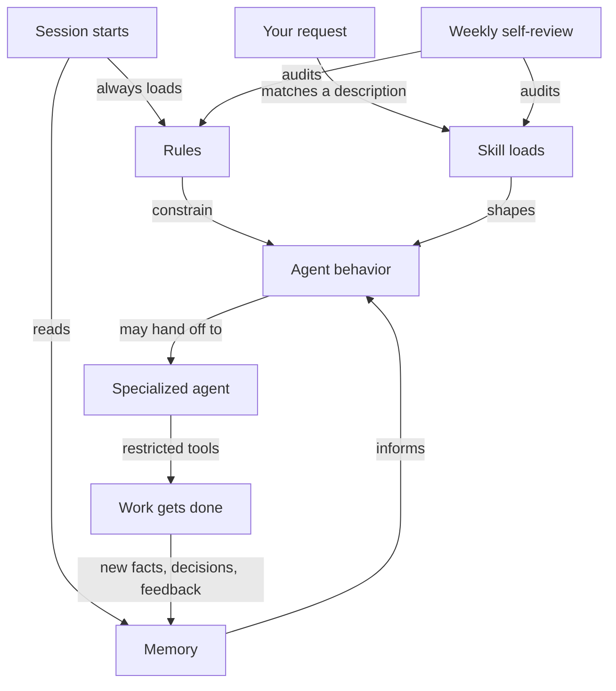

# AI chief of staff

A working, forkable example of a personal operating system for an AI coding agent: rules, skills, agents, and a provenance-tagged memory system that turn a general-purpose assistant into something that behaves consistently across every session, remembers what it learned about you, and knows what it is and is not allowed to do on its own.

New here? Start with [GETTING_STARTED.md](GETTING_STARTED.md) instead of this file. It walks you through forking the repo, running your first skill, and making the system your own in about 15 minutes.

## Contents

- [What is this?](#what-is-this)
- [Why does it exist?](#why-does-it-exist)
- [How it works](#how-it-works)
- [System map](#system-map)
- [How the pieces connect](#how-the-pieces-connect)
- [Growth system](#growth-system)
- [Key files](#key-files)
- [What this means for you](#what-this-means-for-you)

## What is this?

An AI coding agent (Claude Code, Cursor, or similar) reads plain markdown files at the start of a session and every time a matching file or topic comes up. This repo is a structured set of those files: rules that constrain behavior, skills that package expertise the agent loads on demand, agents that take on a specific role for a specific kind of task, and a memory folder the agent writes to and reads from across sessions.

None of the content in this repo is real. The example project (Atlas), the example org (Meridian), the example teaching commitment (AI cohort), and every meeting note or memory file are fabricated to show the shape of the system, not to describe an actual person's actual work. Replace the fabricated content with your own and the system keeps working exactly the same way.

## Why does it exist?

A general-purpose AI agent starts every session from a blank slate. Ask it to write code and it might follow good security practice, or it might not, depending on what it happened to generate that day. Ask it to give advice on a hard decision and it might hand you a confident-sounding answer built from training averages, not from your own reasoning. Ask it to remember something from last week and it cannot, because nothing persists between sessions unless you build a place for it to persist.

This system solves three problems at once:

- Consistency: a rule written once (no SQL string formatting, ask before deleting files, sentence case headings) applies automatically in every session, not only when you happen to remember to ask for it.
- Memory: a lightweight, typed memory folder lets the agent build up an accurate picture of your preferences, past feedback, and in-flight projects, tagged by how much to trust each entry.
- Judgment: some rules exist specifically to stop the agent from handing you a conclusion on a decision that is yours to make, and instead make it stress-test your own thinking.

## How it works

Three layers, loaded differently, doing different jobs.

Rules (`.claude/rules/`) are always-on or glob-scoped behavioral constraints. A rule like `file-protection` applies to every session. A rule like `atlas-production-standards` only loads when you are working inside `Work/example-project/`. Rules are the layer you almost never invoke by name. They just apply.

Skills (`.claude/skills/`) are on-demand expertise. The agent sees a one-line description of each skill up front (cheap, a few hundred tokens) and only loads the full instructions when your request matches. A skill can be as small as a formatting convention or as large as a multi-phase autonomous build process.

Agents (`.claude/agents/`) are specialized personas with their own system prompt and, optionally, a restricted tool list. A meeting-notes agent might only get Read and Write. A git-sync agent might only get Bash. The restriction is enforced by what tools the agent can call, not by asking it nicely not to use tools it has access to.

Memory (`memory/`) is the one layer that persists across sessions on its own. Every entry is typed (user, feedback, project, or reference) and tagged with a provenance tier (a documented decision outranks a hunch), so a future session can weigh conflicting memories correctly instead of treating a guess and a written decision as equally true.

## System map

```
ai-chief-of-staff/
├── Work/
│   └── example-project/           # Stand-in software project (fabricated Atlas example)
├── Learning/
│   └── deep-dives/                # First-principles deep dives (fabricated example)
├── memory/                        # Provenance-tagged persistent memory (user, feedback, project, reference)
├── .agents/
│   └── skills/                    # 3 portable skills, readable by any coding agent
├── .claude/                       # AI infrastructure (Claude Code specific)
│   ├── agents/                    # 8 custom agents
│   ├── skills/                    # 26 reusable skills
│   └── rules/                     # 33 behavioral rules
├── CLAUDE.md                      # Claude Code index (agents, skills, rules)
├── AGENTS.md                      # Universal AI context (any assistant)
├── GETTING_STARTED.md             # Fork-and-run walkthrough
├── GOALS.md                       # Example quarterly goals and metrics
├── GROWTH_SYSTEM.md               # How the growth pillars connect
├── DEPENDENCIES.md                # Central dependency map
├── EXTENSIONS.md                  # Plugins, MCP servers, and how layers connect
├── DECISIONS.md                   # Logged architecture and tool decisions
├── OS_IMPROVEMENTS.md             # Logged system improvements over time
├── CHANGELOG.md                   # Full change history
└── SYSTEM_OVERVIEW.md             # Full granular reference: every component, every hook
```

## AI infrastructure

Component counts are in the [system map](#system-map) above. Details live in source-of-truth files.

| Component | Source of truth | What to find there |
|-----------|-----------------|---------------------|
| Agents (8) | [CLAUDE.md](CLAUDE.md#sub-agents) / [AGENTS.md](AGENTS.md#sub-agents) | Magic words, purpose, trigger phrases |
| Skills (26) | [CLAUDE.md](CLAUDE.md#skills) / [AGENTS.md](AGENTS.md#skills) | Slash commands, descriptions, output paths |
| Rules (33) | [CLAUDE.md](CLAUDE.md#rules) | Scope, glob patterns, enforcement details |
| Plugins and MCP servers | [EXTENSIONS.md](EXTENSIONS.md) | Capabilities, types, what each provides |

## How the pieces connect



Reading the diagram: a session always loads rules and checks memory before anything else happens. Your request matches a skill description, which shapes how the agent approaches the work. For specialized work, the agent hands off to a narrower agent with its own restricted toolset. Whatever gets learned along the way, a decision, a piece of feedback, a new project fact, writes back into memory for the next session. A periodic self-review step audits the rules and skills themselves, so the system that governs the work also gets to improve.

## Growth system

Four pillars form a continuous loop, all optional and all fabricated as an example in this repo. See [GROWTH_SYSTEM.md](GROWTH_SYSTEM.md) for full detail.

| Pillar | Folder | Purpose |
|--------|--------|---------|
| Intake | (your own inbox pipeline) | Stay current on your field |
| Study | `Learning/` | Build deep knowledge over time |
| Practice | (your own daily exercise loop) | Apply what you learned |
| Reference | (your own crystallized notes) | Turn practice into reusable thinking |

Meta-layer: a weekly self-review step audits the whole system and proposes fixes to itself, the same pattern shown in the diagram above.

## Key files

| File | Purpose |
|------|---------|
| [CLAUDE.md](CLAUDE.md) | Claude Code index: current focus, agents, skills, rules |
| [AGENTS.md](AGENTS.md) | Universal AI context for all assistants |
| [GETTING_STARTED.md](GETTING_STARTED.md) | Fork-and-run walkthrough for a first-time user |
| [GOALS.md](GOALS.md) | Example quarterly goals with three-tier metrics |
| [CHANGELOG.md](CHANGELOG.md) | Full change history, newest first |
| [.claude/README.md](.claude/README.md) | Technical config docs (directory tree, formats) |
| [DEPENDENCIES.md](DEPENDENCIES.md) | Central dependency map: what to update when something changes or is deleted |
| [EXTENSIONS.md](EXTENSIONS.md) | How plugins, MCP servers, and custom components connect |
| [SYSTEM_OVERVIEW.md](SYSTEM_OVERVIEW.md) | Full granular reference: every component, session lifecycle, self-maintenance |

## What this means for you

If you want an AI agent that behaves the same way every session instead of drifting, that remembers your preferences instead of making you repeat them, and that knows the difference between a task it can run alone and a decision that is yours to make, fork this repo and replace the fabricated Atlas example with your own work. The mechanism (rules, skills, agents, memory, dependency tracking) does not change. Only the content inside it does.

Start with [GETTING_STARTED.md](GETTING_STARTED.md).

---

*Last updated: example date, replace with your own*
