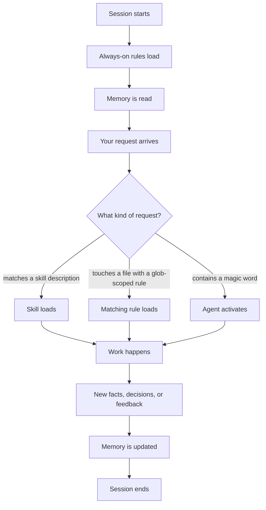

<!-- depends_on: [CLAUDE.md, AGENTS.md, README.md, .claude/README.md, EXTENSIONS.md, DEPENDENCIES.md, GROWTH_SYSTEM.md, .claude/rules/, .claude/skills/, .claude/agents/, .agents/skills/, memory/, Work/example-project/, Learning/deep-dives/] -->
<!-- depended_by: [CLAUDE.md, AGENTS.md, README.md, .claude/README.md] -->

# System overview

The full granular reference for this repo. Every component type, how each one loads, the full session lifecycle from start to finish, how the system maintains itself, and what is deliberately left out of this trimmed example.

Everything named here is fabricated. Atlas is a stand-in project, Meridian a stand-in organization, example.org a stand-in domain. Replace them and the mechanism keeps working the same way.

If you only have five minutes, read [README.md](README.md) instead. This file is for when you want to understand the whole machine, not just the shape of it.

## Contents

- [What is this system?](#what-is-this-system)
- [Folder map](#folder-map)
- [The four layers](#the-four-layers)
  - [Rules](#rules)
  - [Skills](#skills)
  - [Agents](#agents)
  - [Memory](#memory)
  - [The portable layer](#the-portable-layer)
- [How a session works](#how-a-session-works)
- [The growth system](#the-growth-system)
- [How the system maintains itself](#how-the-system-maintains-itself)
  - [Dependency tracking](#dependency-tracking)
  - [The os-maintain skill](#the-os-maintain-skill)
  - [A self-review cadence](#a-self-review-cadence)
  - [Shipping changes](#shipping-changes)
- [What is deliberately not included](#what-is-deliberately-not-included)
- [Quick reference](#quick-reference)

## What is this system?

An AI coding agent with no configuration starts every session the same way: blank. It has no opinion on how you want code written, no memory of what you told it last week, and no sense of which calls are yours to make versus which it can make on its own.

This repo closes that gap with four kinds of files, all plain markdown, all readable and editable by hand.

Rules are behavioral constraints the agent applies without being asked. Skills are packaged expertise the agent loads only when a request matches. Agents are specialized personas with their own restricted toolset. Memory is a folder of facts that survives across sessions, each fact tagged by how much to trust it.

None of these four layers depends on a specific vendor's agent. Any tool that reads a root context file and supports project-scoped rules, skills, or custom commands can run this same system. This repo happens to be built against Claude Code, so the concrete file formats below match that tool's conventions.

## Folder map

```
ai-chief-of-staff/
├── Work/
│   └── example-project/           # Stand-in software project (fabricated Atlas example)
├── Learning/
│   └── deep-dives/                # First-principles deep dives (fabricated example)
├── memory/                        # Provenance-tagged persistent memory
├── .agents/
│   └── skills/                    # 3 portable skills, readable by any coding agent
├── .claude/
│   ├── agents/                    # 8 custom agents
│   ├── skills/                    # 26 reusable skills
│   └── rules/                     # 35 behavioral rules
├── README.md
├── CLAUDE.md
├── AGENTS.md
├── GETTING_STARTED.md
├── GOALS.md
├── GROWTH_SYSTEM.md
├── DEPENDENCIES.md
├── EXTENSIONS.md
├── DECISIONS.md
├── OS_IMPROVEMENTS.md
├── CHANGELOG.md
└── SYSTEM_OVERVIEW.md             # This file
```

There is no `.claude/hooks/`, no `.claude/scripts/`, and no `.claude/workflows/` folder in this repo. That is intentional. See [What is deliberately not included](#what-is-deliberately-not-included).

## The four layers

Each layer loads differently and answers a different question. Rules answer "what must always be true." Skills answer "what expertise applies to this request." Agents answer "who should do this specific piece of work." Memory answers "what do we already know."

### Rules

A rule is a markdown file in `.claude/rules/` with YAML frontmatter. It loads in one of two ways.

Always-on rules load at the start of every session, no matter what you are doing. Use this sparingly, for behavior that should never lapse: do not delete files without asking, write in plain language, ask one question at a time. The frontmatter marks this with `alwaysApply: true`.

Glob-scoped rules load only when you touch a file matching a path pattern. A rule scoped to `Work/example-project/**` stays silent everywhere else in the repo and switches on the moment you open a file inside that folder. This is how project-specific standards, a security pattern, a framework convention, stay out of your way in unrelated work. The frontmatter carries a `globs` array instead of `alwaysApply: true`.

```yaml
---
description: "What this rule enforces"
alwaysApply: true
globs: ["Work/example-project/**"]   # omit when alwaysApply is true
---
```

Almost every rule in this repo follows a three-state permission pattern inside its body: allow (the agent does this freely), deny (the agent never does this on its own), and ask (the agent pauses and confirms first). Writing a rule without sorting its actions into these three buckets leaves it ambiguous about what it actually governs, which is why `.claude/rules/system-design-patterns.md` calls this out as a required pattern for any new rule.

This repo ships 35 rules. The full table, with exact scope and what each one enforces, lives in [CLAUDE.md](CLAUDE.md#rules). That table is the source of truth. Treat this section as the explanation of the mechanism, not a second copy of the list, so the two never drift apart.

Three rules are worth naming here because they shape how every other rule behaves rather than governing one specific task:

- `pause-before-acting`, which is the rule that makes the other 32 actually get checked. Before the agent's first tool call, it stops and asks whether any rule applies to the file type or task at hand. It also carries the numbered precedence table that settles a conflict between two instruction sources by rank rather than in the moment, and requires the agent to name which source won.
- `system-design-patterns`, which governs how new rules, skills, and agents get written in the first place: three-state permissions, snapshot before mutate, specialize by tool access, and the description-as-routing-contract principle covered under skills below.
- `dependency-tracking`, which requires every rule, skill, and agent to declare `depends_on` and `depended_by` in its own frontmatter, and requires `DEPENDENCIES.md` to hold the folder-level and cross-component map that survives a file being deleted.

### Skills

A skill lives at `.claude/skills/<skill-name>/SKILL.md`, one folder per skill, one required file inside it.

Skills load through progressive disclosure, in three stages:

1. Metadata loads first. The agent scans every skill's one-line description at the start of a session, at a cost of roughly a hundred tokens per skill. This is cheap enough to do for all 26 skills every time.
2. Full instructions load only when a request matches. The body of the matching `SKILL.md`, kept under about five thousand tokens by convention, loads into context and the agent follows it.
3. Bundled files load only as needed. A skill can reference additional templates, examples, or reference material inside its own folder, and those load only if the instructions call for them.

The one-line description is the single highest-leverage sentence in a skill file. It is a routing contract, not a summary. Get it wrong, write the steps into the description instead of what the skill does and when to use it, and the agent either follows the summary and skips the real instructions, or the skill never fires because nothing about the description matched the request. `.claude/rules/system-design-patterns.md` names this failure mode directly.

```yaml
---
name: skill-name
description: Brief description of what this skill does and when to use it
---
```

Skills in this repo split into three rough categories: communication (first-principles, socratic-questioning, objective-review), research (cs-research, biomedical-research, web-research), and workflow (everything else, from book-builder-hard-skills to bossman-mode). The full table of all 26, with exact invocation syntax, lives in [CLAUDE.md](CLAUDE.md#skills).

A skill can invoke another skill or hand off to an agent. `ship` runs docs-sync then git-sync in sequence. `checkin-notes` runs meeting-notes, then action-planner, then ship. `bossman-mode` dispatches fresh-context subagents per phase, choosing which at runtime rather than following a fixed call chain. `DEPENDENCIES.md` tracks these composition chains under "Skills that invoke other skills," because a change to one skill's output shape can silently break whatever calls it next.

### Agents

A custom agent lives at `.claude/agents/<agent-name>.md`, a single file with YAML frontmatter and a system prompt.

```yaml
---
name: agent-name
description: When this agent should be invoked
tools: tool1, tool2, tool3   # optional, omit to inherit all tools
model: sonnet                # optional
---
```

Agents activate two ways. Automatically, when a magic word or trigger phrase appears in conversation, "I had a meeting with a stakeholder" triggers the meeting-notes agent without you naming it. Or explicitly, when you ask for a named agent directly, "use the first-principles agent to explain the memory system."

The tools field is where an agent's restriction actually lives, not in a sentence asking it to behave. A meeting-notes agent that only ever reads raw notes and writes structured ones gets `Read, Write, Glob` and nothing else. It cannot run a shell command even if a prompt injection inside a meeting transcript tried to talk it into one, because the capability does not exist for it to call. This is the specialize-by-tool-access principle: remove the ability, do not just ask the agent not to use it.

This repo ships 8 agents. The full table with magic words and purpose lives in [CLAUDE.md](CLAUDE.md#sub-agents).

### Memory

Memory is the one layer that changes on its own, driven by what happens during a session rather than by which file you opened. It lives in `memory/`, split into four types: user, feedback, project, and reference.

Every memory entry is tagged with a provenance tier, from highest to lowest trust:

| Tier | Meaning |
|------|---------|
| Documented decision | A written record of a decision with its reasoning, a DECISIONS.md entry, meeting notes that say "we decided X" |
| Documented research | Published data, official documentation, a benchmark result |
| Stakeholder verbal | Something a person said in conversation, not yet written down anywhere else |
| PM intuition | A read on the situation with no external validation behind it |

When two memories conflict, the higher tier wins unless the lower tier is more recent and explicitly supersedes it. The two lower tiers also decay: a stakeholder verbal memory older than about six weeks and a PM intuition memory older than about four weeks still surface when recalled, but flagged as possibly stale, worth re-confirming rather than treated as settled fact. Documented decisions and documented research do not decay this way. They stay evergreen unless a newer, higher-trust memory replaces them.

`.claude/rules/memory-provenance.md` is the rule that enforces the tagging and the decay behavior. Every skill or agent that writes a new memory entry follows that rule's format, a `type` field plus, for feedback and project entries, the tier tag.

### The portable layer

`.agents/skills/` holds tool-agnostic copies of three skills: first-principles, objective-review, and socratic-questioning. These three do not depend on this repo's file layout or on Claude Code specifically, so a canonical copy sits outside `.claude/` where any coding agent, not only this one, can read it.

The `.claude/skills/` version of each of these three points back to its `.agents/` counterpart with a `canonical_copy` field in its own frontmatter. The two copies must always match. `DEPENDENCIES.md` lists this as a bidirectional sync: whichever copy you edit, copy the change to the other, or the two versions drift and a future session gets inconsistent guidance depending on which agent it happens to be running in.

## How a session works

A session moves through the same sequence every time, whether the request is a one-line question or a multi-hour autonomous build.



Walking through each step:

Session starts. The agent reads the root context file, `CLAUDE.md` for Claude Code, `AGENTS.md` for any other assistant, and every always-on rule loads at this point regardless of what you are about to ask.

Rules load. Always-on rules are already in context from the step above. Glob-scoped rules stay dormant until you touch a matching file, so opening a file inside `Work/example-project/` is what pulls in that folder's production-standards rule, not the session starting.

Memory is read. The agent checks `memory/` for relevant prior facts, feedback, decisions, and reference material before it forms a plan, so a project fact from three sessions ago still shapes today's answer.

Request comes in. Your message is matched against every skill's one-line description and every agent's magic words at once, not sequentially. A request can match more than one thing, a skill that itself hands off to an agent partway through.

Skill or agent dispatch. If a skill matches, its full instructions load and the agent follows them, potentially invoking another skill or handing off to a named agent along the way. If a magic word matches instead, an agent activates directly with its own system prompt and its own restricted toolset.

Work happens. This is the actual task, writing a file, running a command, answering a question, whatever the matched skill or agent is built to do.

Memory updates. Anything worth remembering next session, a new project fact, a piece of feedback, a decision with its reasoning, gets written to the matching file in `memory/` with a provenance tag.

Session ends. Nothing further happens automatically unless a periodic self-review step exists (see [A self-review cadence](#a-self-review-cadence)). The next session starts the same cycle over from the top.

## The growth system

`GROWTH_SYSTEM.md` describes four pillars that form a continuous loop: intake, study, practice, and reference. In this repo, only the study pillar has a concrete folder behind it, `Learning/deep-dives/`, holding one fabricated example. The other three pillars, an intake pipeline for staying current in your field, a daily practice loop, a place where practice crystallizes into reusable reference notes, are described as patterns you would build your own version of, not as folders that ship here.

This mirrors the trimmed-versus-mature framing that runs through the whole repo. The mechanism is real and complete. Some of the folders behind it are fabricated examples rather than a fully populated system, on purpose, so that forking this repo does not hand you someone else's actual practice history along with the framework.

## How the system maintains itself

A system that governs how work gets done should also get to improve itself. Four things make that possible here.

### Dependency tracking

Every rule, skill, and agent declares two fields in its frontmatter, `depends_on` and `depended_by`. The first lists what the component reads or requires. The second lists what would need updating if the component changed.

```yaml
depends_on: [file1, file2]
depended_by: [file1, file2]
```

`DEPENDENCIES.md` is the central map that survives a file being deleted, since a deleted file's own frontmatter disappears along with it. It tracks folder-level dependencies, bidirectional syncs that must always match (like the `.agents/skills/` and `.claude/skills/` portable copies), component-to-component chains (which skill invokes which, which agent uses which rule), and a deletion checklist so removing a component does not leave a dangling reference behind in an index file.

Before committing a change to any rule, skill, or agent, the practice this repo follows is to read that component's own `depended_by` field and walk each listed dependency, rather than relying on memory of what probably references it.

### The os-maintain skill

`os-maintain` is the skill that keeps the index files in sync after a component changes. Add a new rule, and it is the mechanism that would update `CLAUDE.md`, `.claude/README.md`, and `README.md` so the new rule shows up everywhere it needs to, rather than only in the one place you added it by hand.

It also scaffolds new components and, per its own description in [CLAUDE.md](CLAUDE.md#skills), can keep a genericized portfolio copy of a real, private system in sync. This repo is itself an example of that output, a sanitized structure with the same mechanism as a real working setup, fabricated names in place of anything specific to one person's actual work.

### A self-review cadence

`system-retro` is the skill in this repo built for periodic self-review, the system auditing its own rules and skills for drift, gaps, or rules that no longer match how the work actually happens, then proposing and applying fixes.

In a fully built-out version of this pattern, the cadence would look something like this, run on whatever schedule fits your own working rhythm, weekly is a common default:

1. Read every rule and skill in `.claude/`, checking each one's stated scope against how it has actually been used since the last review.
2. Flag rules that never fired, skills whose description no longer matches what they do, or components whose `depends_on` and `depended_by` fields have gone stale.
3. Propose fixes as clear-content or judgment-tier changes, per the same three-tier taxonomy that governs any automated edit, mechanical fixes apply silently, judgment calls get flagged for you to decide, never applied on their own.
4. Log any adopted fix to `OS_IMPROVEMENTS.md`, and to `DECISIONS.md` as well if the fix is a heavyweight, hard-to-reverse structural choice.

Think of this as your own system-retro cadence, whatever shape you build it in. The skill ships here as a working example, not as a fixed prescription. The point is that the system that constrains your agent should periodically get to look at itself with the same rigor it applies to everything else.

### Shipping changes

`ship` is the skill that runs docs-sync, then git-sync, in that order. docs-sync updates the standard documentation files, index tables, counts, cross-references, after content or component changes. git-sync then commits and pushes. Running them as one combined step means a documentation change never lands without the code or content change it describes, and vice versa.

## What is deliberately not included

This repo ships rules, skills, agents, and memory. It does not ship `.claude/hooks/`, `.claude/scripts/`, or `.claude/workflows/`. That is a deliberate trim, not an oversight, because all three are heavily tied to one specific machine, shell, and set of external services in a way that rules, skills, and agents are not.

Hooks are shell scripts triggered on specific session events, a script that runs when a session starts and prints a summary of recent commits, one that runs before every tool call and blocks a write to a protected path as a deterministic backstop rather than relying on a rule alone catching it. A hook is the right tool when you want a check that never depends on the agent choosing to read a rule first, because a human approving a prompt without reading it is a documented failure mode, and a hook that hard-blocks an action does not have that failure mode.

Scripts are small, standalone programs that a skill or hook calls out to, a frontmatter validator that checks every rule and skill has both `depends_on` and `depended_by` filled in, a broken-link checker that runs before a docs-sync commit lands. Where a skill in this repo describes a check in prose, `os-maintain` or `wiki-lint`, for example, a fully built-out version would often replace that prose description with an actual script the skill shells out to, faster and less prone to the agent skipping a step under pressure.

Workflows are scheduled or externally triggered automations, a cron job that pulls new items from an inbox on a schedule and runs a skill against each one, rather than waiting for you to type a request. This repo's skills all activate on a request or a magic word. None of them run on a timer, because a scheduled trigger needs the same machine-specific plumbing as hooks and scripts do.

If you build any of these three, `.claude/hooks/` for session and tool-call triggers, `.claude/scripts/` for standalone validation and utility scripts, `.claude/workflows/` for scheduled or externally triggered automations, they slot in as siblings to `.claude/rules/`, `.claude/skills/`, and `.claude/agents/` at the same level, following the same frontmatter and description conventions covered in [The four layers](#the-four-layers) above. Update `.claude/README.md`'s directory structure and this file's folder map once they exist, so the two stay accurate.

## Quick reference

Component counts:

| Layer | Count | Location |
|-------|-------|----------|
| Rules | 33 | `.claude/rules/` |
| Skills | 26 | `.claude/skills/` |
| Agents | 8 | `.claude/agents/` |
| Portable skills | 3 | `.agents/skills/` |
| Memory types | 4 (user, feedback, project, reference) | `memory/` |

Where do I look for X:

| Question | Look here |
|----------|-----------|
| What does rule X enforce, and in what scope | [CLAUDE.md](CLAUDE.md#rules) |
| What does skill X do, and how do I invoke it | [CLAUDE.md](CLAUDE.md#skills) |
| What does agent X do, and what magic words trigger it | [CLAUDE.md](CLAUDE.md#sub-agents) |
| What changes if I delete or rename a component | [DEPENDENCIES.md](DEPENDENCIES.md) |
| How do plugins and MCP servers fit in | [EXTENSIONS.md](EXTENSIONS.md) |
| What have I decided, and why | [DECISIONS.md](DECISIONS.md) |
| What have I already changed about this system | [OS_IMPROVEMENTS.md](OS_IMPROVEMENTS.md) |
| What is the full change history | [CHANGELOG.md](CHANGELOG.md) |
| How do I fork this and make it mine | [GETTING_STARTED.md](GETTING_STARTED.md) |
| What is my current focus and quarterly goals | [CLAUDE.md](CLAUDE.md#current-focus), [GOALS.md](GOALS.md) |

Key file paths:

- `.claude/rules/` for behavioral constraints
- `.claude/skills/<name>/SKILL.md` for on-demand expertise
- `.claude/agents/<name>.md` for specialized personas
- `.agents/skills/` for the tool-agnostic portable copies
- `memory/` for persistent, provenance-tagged facts
- `Work/example-project/` for the one folder in this repo that behaves like a real software project
- `Learning/deep-dives/` for first-principles analysis docs

---

*Last updated: example date, replace with your own*
